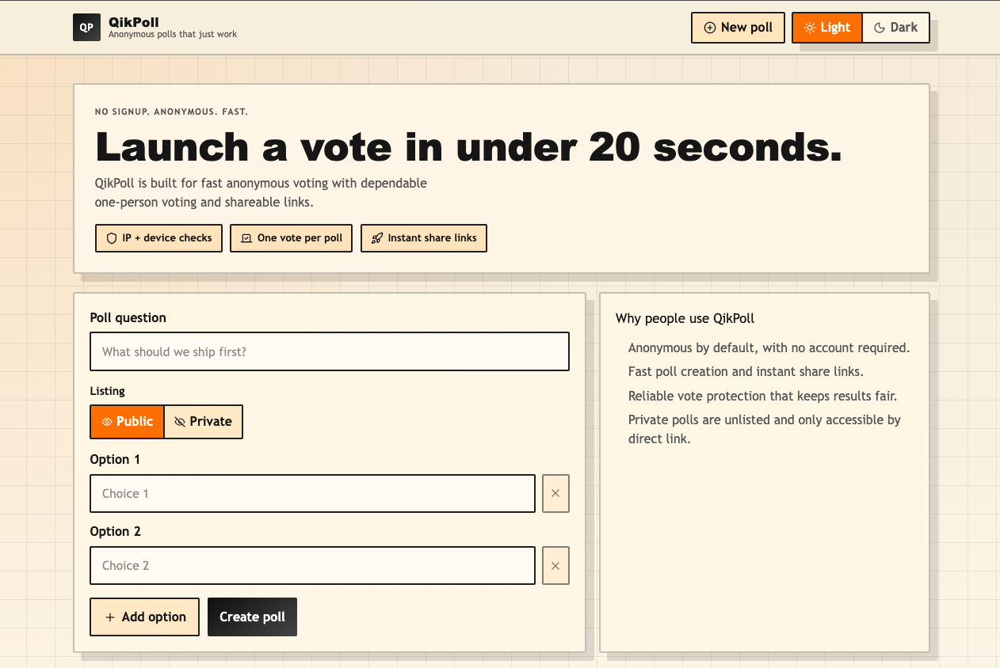

# QikPoll

Anonymous polls that just work.




## Overview

QikPoll is a StrawPoll-style app for fast, no-signup polling. Anyone can create a poll, share a link, and watch results update live in real time.

## Core features

- Create polls in seconds with 2 to 8 options.
- Use `public` visibility to list polls in the home feed.
- Use `private` visibility for unlisted direct-link access.
- Anonymous voting with anti-repeat guardrails.
- Live vote updates on poll pages via WebSockets.
- Live updates for the recent public poll feed.
- Redis-backed storage with TTL expiration.

## Technology stack

| Area | Technology |
| --- | --- |
| Runtime | Bun |
| Language | TypeScript |
| Frontend | React 19 |
| App framework | TanStack Start + TanStack Router |
| Styling/UI | CSS + Lucide icons |
| Data store | Redis 5 |
| Realtime | WebSockets + Redis Pub/Sub |
| Build tooling | Vite 7 |
| Quality tooling | Biome + Vitest |

## Architecture

- `src/routes/index.tsx`: Home screen, poll creation, and recent public polls feed.
- `src/routes/p/$pollId.tsx`: Poll voting page with live results.
- `src/routes/api/polls.tsx`: Poll create/fetch/list handlers.
- `src/routes/api/polls.vote.tsx`: Vote submission endpoint.
- `src/routes/api/live.tsx`: WebSocket upgrade endpoint.
- `src/lib/server/polls.ts`: Poll domain logic, vote restrictions, rate limiting.
- `src/lib/server/poll-live.ts`: Pub/Sub fanout for realtime updates.
- `src/lib/server/redis.ts`: Shared Redis client.

## Redis data model

- `poll:<id>` stores the poll JSON document.
- `poll:index:public` stores recent public poll IDs in a sorted set.
- `poll:vote:fp:<pollId>:<fingerprintHash>` enforces one vote per fingerprint.
- `poll:vote:ip:<pollId>:<ipHash>` adds one-vote guardrail by hashed IP.
- `poll:rate:create:<ipHash>` limits poll creation bursts.
- `poll:rate:vote:<pollId>:<ipHash>` limits vote-attempt bursts.

## Realtime channels

- `GET /api/live?pollId=<pollId>` streams per-poll vote updates.
- `GET /api/live?stream=public` streams recent public poll feed updates.

## Local setup

1. Install dependencies.

```bash
bun install
```

2. Start Redis locally.

```bash
redis-server
```

3. Create `.env`.

```bash
REDIS_URL=redis://localhost:6379
POLL_TTL_SECONDS=604800
POLL_FINGERPRINT_SALT=change-me-in-production
```

4. Start the app.

```bash
bun --bun run dev
```

App URL: [http://localhost:3000](http://localhost:3000)

## API endpoints

- `POST /api/polls` creates a poll.
- `GET /api/polls?id=<pollId>` fetches a poll by ID.
- `GET /api/polls?limit=<n>` lists recent public polls.
- `POST /api/polls/vote` submits a vote.
- `POST /api/mcp` MCP JSON-RPC endpoint for remote MCP clients.
- `GET /api/live?pollId=<pollId>` upgrades to poll websocket stream.
- `GET /api/live?stream=public` upgrades to public feed websocket stream.

## MCP server

This repo includes an MCP endpoint served by the same TanStack Start server:
`/api/mcp`.
It calls the existing poll logic, so MCP users do not need direct Redis access.

Tools exposed:

- `create_poll` create a poll (`title`, `options`, optional `visibility`).
- `list_public_polls` list public polls (`limit` optional).
- `get_poll` fetch poll details and current results by `pollId`.
- `vote_poll` submit vote (`pollId`, `optionId`).

Example OpenCode remote MCP config (`~/.config/opencode/opencode.json`):

```json
{
  "$schema": "https://opencode.ai/config.json",
  "mcp": {
    "qikpoll": {
      "type": "remote",
      "url": "https://your-qikpoll-app.example.com/api/mcp",
      "enabled": true
    }
  }
}
```

Use your deployed app URL for `url`.
This OpenCode setup uses a remote MCP endpoint hosted by your app server.

## Environment variables

- `REDIS_URL` required Redis connection URL.
- `POLL_TTL_SECONDS` poll and vote lock expiration in seconds.
- `POLL_FINGERPRINT_SALT` salt used in hashing anti-abuse identifiers.

## Scripts

- `bun --bun run dev` start dev server.
- `bun --bun run build` build for production.
- `bun --bun run preview` run preview server.
- `bun --bun run mcp` optional standalone stdio MCP server for local testing.
- `bun --bun run test` run tests.
- `bun --bun run lint` run lint checks.
- `bun --bun run check` run full Biome checks.
- `bun --bun run format` format code.

## Security and fairness notes

- Raw IP addresses are not stored; only salted hashes are used.
- Vote writes are atomic using a Redis Lua script to reduce race-condition double-votes.
- Poll and vote lock keys share TTL expiration behavior.
